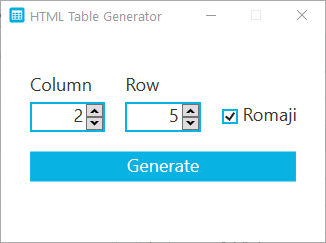

# HTML Table Generator

**HTML Table Generator** is a WPF application that takes inputs from the user and generates HTML table code accordingly making the whole process a lot easier.


## Backstory
I was working on an ebook file that I intended to read on my kindle. The file had many Japanese dialogues and vocabularies that needed to be formatted into an HTML table so that the kindle can display it nicely.
I also had to make sure it supports Furigana by using [HTML ruby syntax](https://developer.mozilla.org/en-US/docs/Web/HTML/Element/ruby) tag.

Coding this by hand was very tedious and close to impossible. So, I decided to make a tool that can automate the process. The HTML Table Generator is the result of that, along with another tool, the **[Furigana Tool](https://github.com/showmik/furigana-tool)**.

## How to Use


Suppose the case, this dialogue, which is from the Japanese textbook *[Genki](https://en.wikipedia.org/wiki/Genki:_An_Integrated_Course_in_Elementary_Japanese)*, needed to be incorporated in an ebook file in such a way that the kindle can read it nicely.

Formatting it into an HTML table would do the job and the code (excluding Furigana and styling) would look something like this:
```
<table>
    <tr>
       <td>だけし:<br/>Takeshi</td>
       <td>こんにちは。きむら たけしです。<br/>Konnichiwa. Kimura Takeshi desu.</td>
    </tr>
    <tr>
       <td>メアリー:<br/>Mearii</td>
       <td>メアりー・ハートです。あのう、りゅうがくせいですか。<br/>Mearii Haato desu. Anoo, ryuugakusee desu ka.</td>
    </tr>
    <tr>
       <td>だけし:<br/>Takeshi</td>
       <td>いいえ、にほんじんです。<br/>iie, nihonjin desu.</td>
    </tr>
    <tr>
       <td>メアリー:<br/>Mearii</td>
       <td>そうですか。なんねんせいですか。<br/>Soo desu ka. Nannensee desu ka.</td>
    </tr>
    <tr>
       <td>だけし:<br/>Takeshi</td>
       <td>よねんせいです。<br/>Yonensee desu.</td>
    </tr>
</table>

```


### To do the same with this **HTML Table Generator**:
* First, input how many rows and columns you need. In this case, It is two columns and five rows. Also check on the romaji support check box and then click on **Generate**.

  
  
* It will generate a new window containing input text boxes corresponding to the number of rows and columns you entered. Fill up these boxes with proper input and then click **Run**.
  
  
  
* It will generate another window with the final table code. You can copy the whole thing by clicking on **Copy**.

  

  
After adding some style to it it looks something like this:


