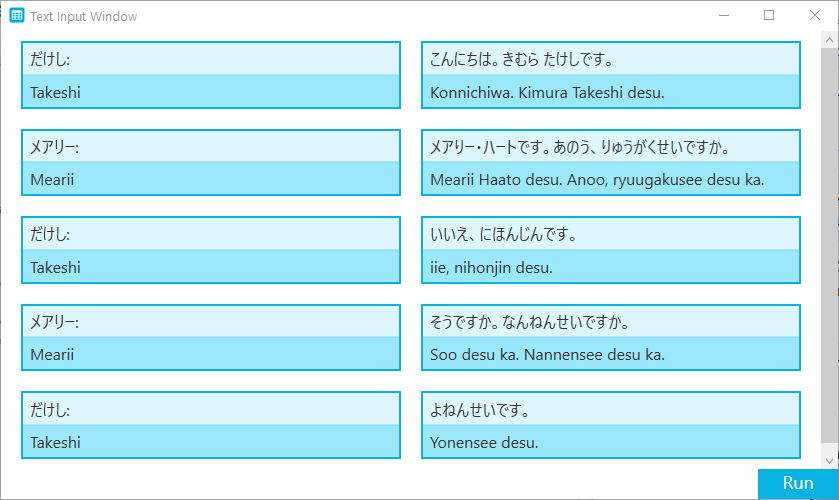
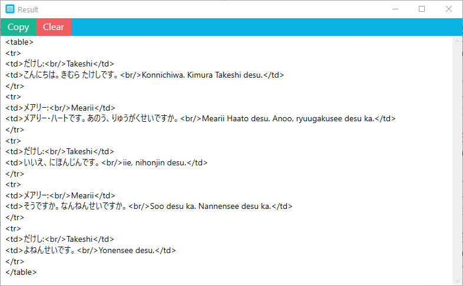

# HTML Table Generator

**HTML Table Generator** is a tool that generates HTML table code from user input or CSV files.

## Backstory

I was working on an ebook file that I planned to read on my Kindle. The file had numerous Japanese dialogues and vocabularies that needed to be turned into an HTML table for the kindle to display properly.
I also had to use HTML [ruby](https://developer.mozilla.org/en-US/docs/Web/HTML/Element/ruby) syntax to ensure that it supported Furigana.

Coding this by hand was very tedious and close to impossible. So, I decided to make a tool that can automate the process. The HTML Table Generator is the result of that, along with another tool, the **[Furigana Tool](https://github.com/showmik/furigana-tool)**.

## How to Use


Suppose the case, this dialogue, which is from the Japanese textbook *[Genki](https://en.wikipedia.org/wiki/Genki:_An_Integrated_Course_in_Elementary_Japanese)*, needed to be incorporated in an ebook file in such a way that the kindle can read it nicely.

Formatting it into an HTML table would do the job and the code (excluding Furigana and styling) would look something like this:

```
<table>
    <tr>
       <td>だけし:<br/>Takeshi</td>
       <td>こんにちは。きむら たけしです。<br/>Konnichiwa. Kimura Takeshi desu.</td>
    </tr>
    <tr>
       <td>メアリー:<br/>Mearii</td>
       <td>メアりー・ハートです。あのう、りゅうがくせいですか。<br/>Mearii Haato desu. Anoo, ryuugakusee desu ka.</td>
    </tr>
    <tr>
       <td>だけし:<br/>Takeshi</td>
       <td>いいえ、にほんじんです。<br/>iie, nihonjin desu.</td>
    </tr>
    <tr>
       <td>メアリー:<br/>Mearii</td>
       <td>そうですか。なんねんせいですか。<br/>Soo desu ka. Nannensee desu ka.</td>
    </tr>
    <tr>
       <td>だけし:<br/>Takeshi</td>
       <td>よねんせいです。<br/>Yonensee desu.</td>
    </tr>
</table>

```


### To do the same with this **HTML Table Generator**:

* First, input how many rows and columns you need. In this case, It is two columns and five rows. Also check on the romaji support check box and then click on **Generate**.

  
  
* It will generate a new window containing input text boxes corresponding to the number of rows and columns you entered. Fill up these boxes with proper input and then click **Run**.
  
  
  
* It will generate another window with the final table code. You can copy the whole thing by clicking on **Copy**.

  

  
After adding some style, it looks something like this:


